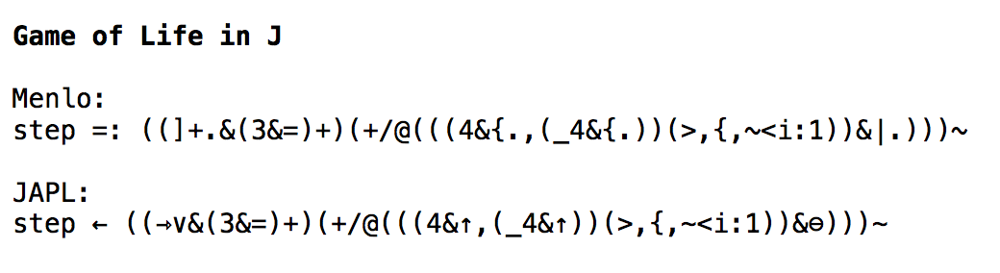

This is an experimental font for makinig J look like APL.

Currently based on the Menlo font, looking to do something different later.

* <https://en.wikipedia.org/wiki/APL_syntax_and_symbols>
* <https://code.jsoftware.com/wiki/NuVoc>
* <https://news.ycombinator.com/item?id=8605606>

See <subs.txt> for information on the substitutions.
